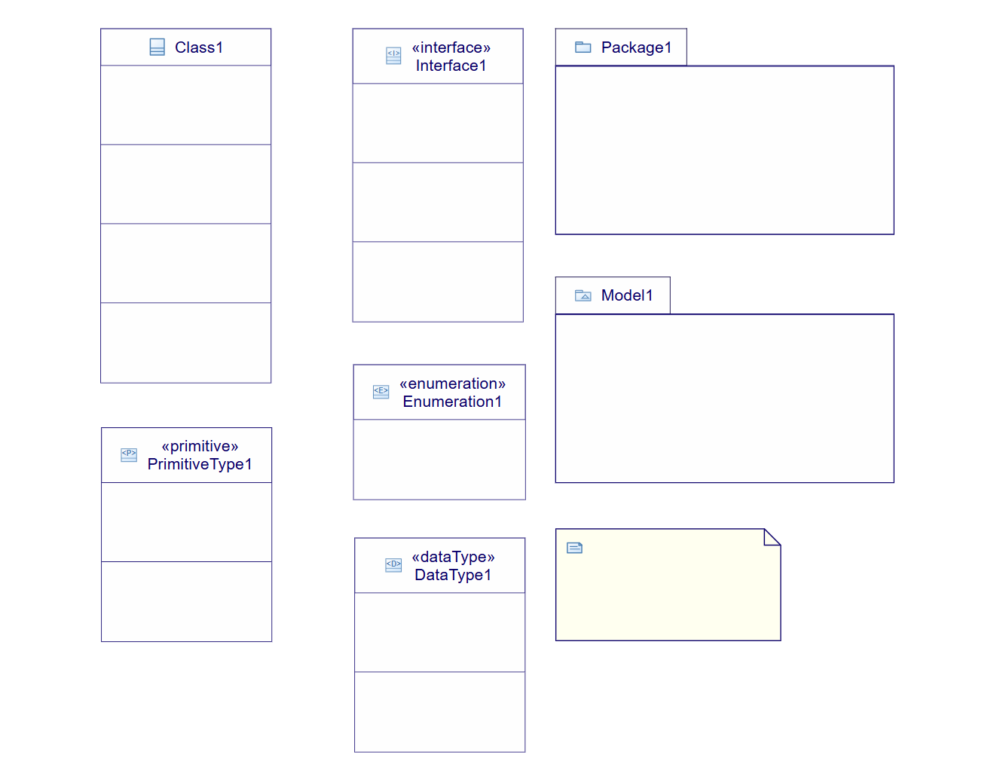
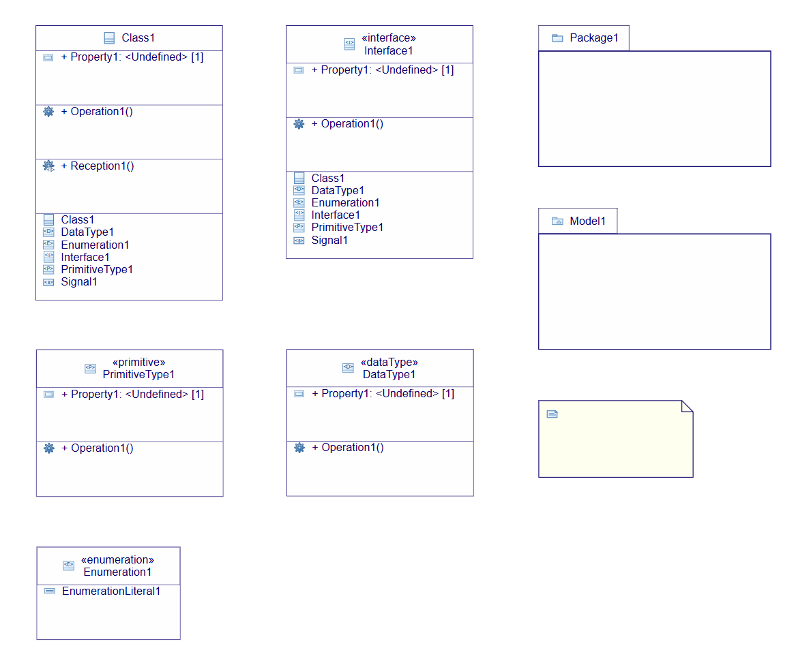
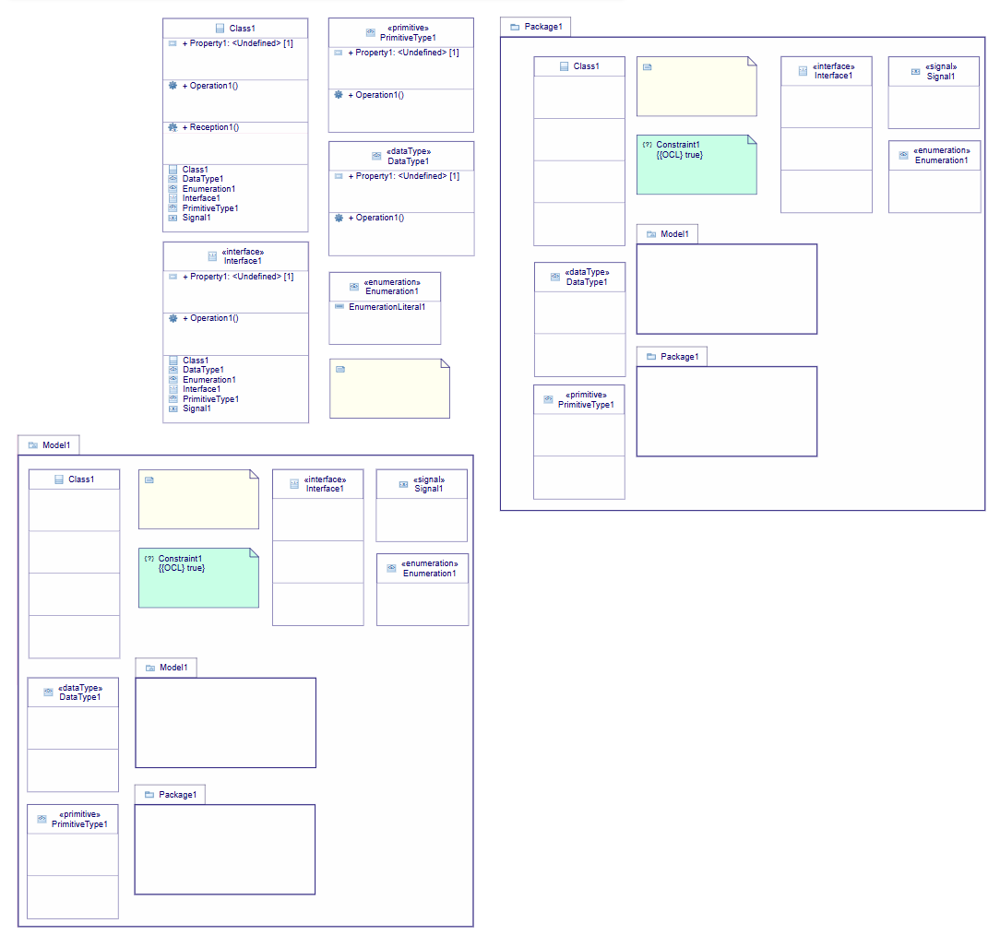
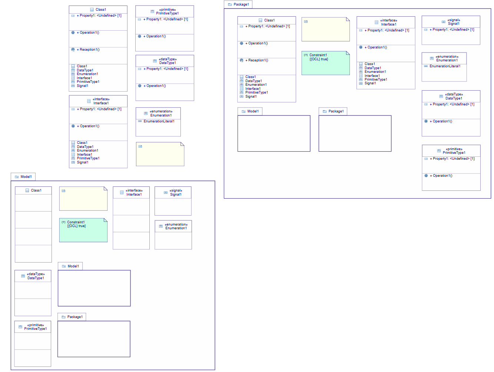
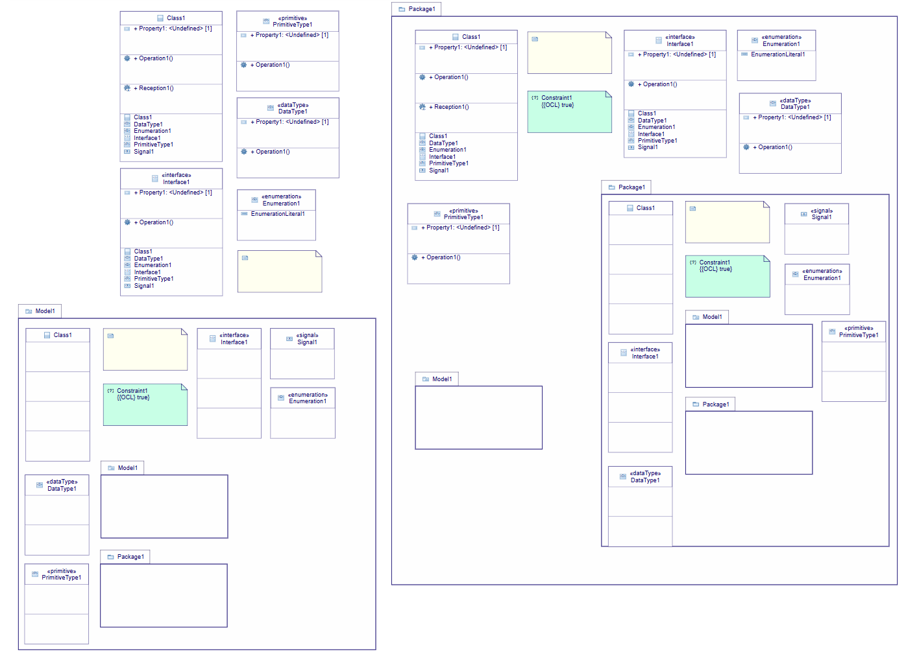
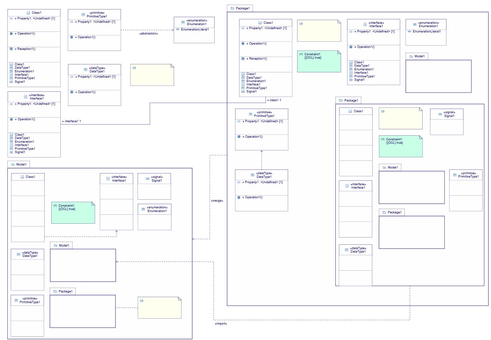
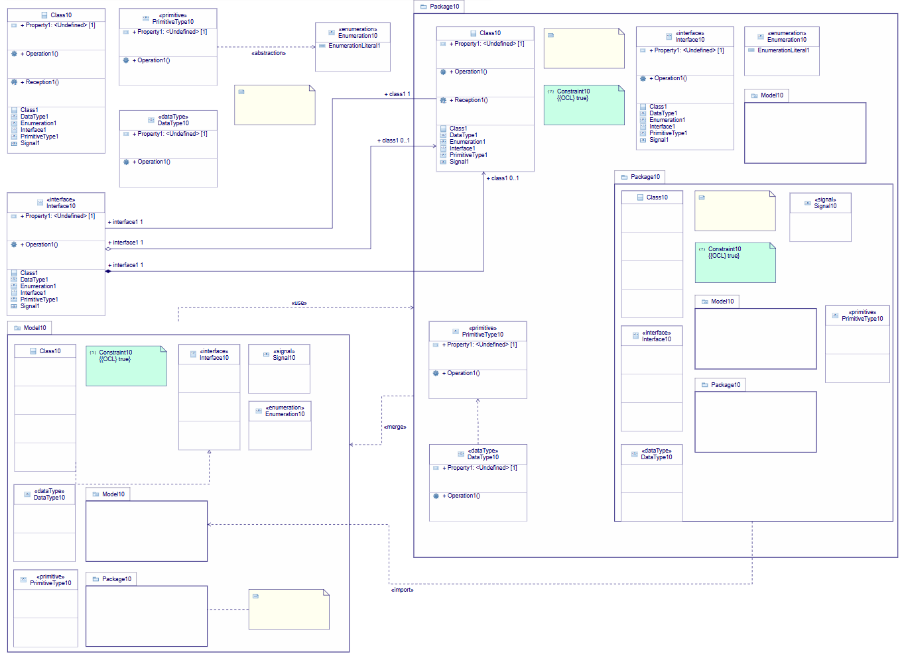
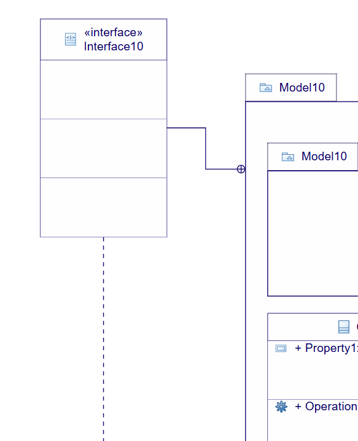

= Class Diagram Tests
:toc:

[WARN]
====
Do all those tests sequentially
====

== CD01 - Node Creations

.Purpose
Check all node creations in the _Class Diagram_

.Recipe

. Create a new project: from _UML Empty_ template.
. Rename this project _CD01_
. From the _Explorer_ view use the + icon to create a new model.
. In the model creation dialog, choose _Model UML_ as the Model type and call this model _UML_.
. From the _Explorer_ view use the contextual menu from *Model* to create a new _Class Diagram_.
** [ ] A new empty _Class Diagram_ is created and opened
. Using the _palette_ creates the following root elements:
** _Class_
** _Interface_
** _DataType_
** _Enumeration_
** _Primitive Type_
** _Package_
** _Model_
** _Comment_
*** [ ] The diagram should look like this
+

+
. For all nodes with _list compartment_ create one instance for each child
+
[INFO]
====
In the _Nested Classifier Compartment_ of the _Class_ use both the _normal_ tools (available from the background of the compartment) and the _sibling_ tools (available when another _nested classifier_ is selected).
====
+

+
. In both the _Package_ and the _Model_ create all possible children
+

+
. In the _Package 1_, for all those children with compartment list, create all possible children.
+

+
. In *Package1::Package1* create all possible children.
+

== CD10 - Edge Creations

.Requirements
. Start from the state of _CD01_

.Purpose
Check all edges creation in the _Class Diagram_

.Recipe
. Create a _Package Merge_ between *Package1* and *Model1*
** [ ] A link between those nodes appears with label «merge»
. Create a _Package Import_ between *Package1::Package1* and *Model1::Model1*
** [ ] A link between those nodes appears with label import
. Using the _Connector_ tool create an _Abstraction_ between *PrimitiveType1* and *Enumeration1*
** [ ] A link with «abstraction» should be displayed between those nodes.
. Create a _Dependency_ between *Package1::DataType1* and *Package1::PrimitiveType1*
** [ ] A link without label should be displayed between those nodes.
. Create a _InterfaceRealization_ between *Model1::Class1* and *Model1::Interface1*
** [ ] A link without label should be displayed between those nodes.
. Link the comment *Model1::Comment* to *Model1::Package1*
** [ ] A link without a label should be displayed between those nodes.
** [ ] *Package1* should now belong to the _annotatedElement_ feature of the _Comment_ (Look into the _Property View__).
. Creates an association between *Interface1* and *Package1::Class1*
** [ ] A link with no centered label is displayed
** [ ] The _begin label_ of the edge is *+ interface1 1*
** [ ] The _end label_ of the edge is *+ class1 1*
+

+
. Create a _Shared Association_ between *Interface1* and *Package1::Class1*
** [ ] A link with no centered label is displayed
** [ ] The _begin label_ of the edge is *+ interface1 1*
** [ ] The _end label_ of the edge is *+ class1 0..1*
** [ ] The source decorator is an empty diamond
** [ ] The end decorator is an arrow
. Create a _Composite Association_ between *Interface1* and *Package1::Class1*
** [ ] A link with no centered label is displayed
** [ ] The _begin label_ of the edge is *+ interface1 1*
** [ ] The _end label_ of the edge is *+ class1 0..1*
** [ ] The source decorator is a filled diamond
** [ ] The end decorator is an arrow
. Create a _Usage_ between *Model1* and *Package1*
** [ ] A link between those nodes is displayed
** [ ] The centered label is equal to "«use»"

== CD20 - Direct edit

.Requirements
. Start from the state of _CD10_

.Purpose
Check all the _Direct Edit Tools_

.Recipe
. For all nodes (except from _Comments_), use the _Direct Edit Tool_ (either by using the palette entry, the key shortcut _F2_ or a _double click_) to add an extra *0* at the end of the name.
** [ ] The label and the _name_ of the element should be changed
+

+
. Using the _direct edit_ set the body of the root comment to (multiple lignes using the _Shift_ key):
A body +
with +
multiple lines.
** [ ] The text should be displayed inside the comment
. Using the _direct edit tool_ change the name of the _Association_ to : *Association1*

== CD30 - Drag and Drop (inside Diagram)

.Purpose
Check all the drag and drop in the _Class Diagram_.

.Recipe
Create a new Package Pack_1 and a sub model Model_01.
Drag and Drop all the element of the diagram inside Pack_1 or Model_01 alternatively.

=== From Diagram to Package
Take all the dropped element in the previous step and put them back in the diagram (outside Pack_1 and Model_01).
Delete Pack_1 (and Model_01) from Model.

=== Inside Nodes
* Take a Property from a Class -> Drag and drop it in an Interface, in a DataType, a PrimitiveType, a Signal and in the original Class (make sure to use the first compartment of each node on drop, which the one containing properties).
* Take an Operation from a Class -> Drag and drop it in an Interface, in a DataType, a PrimitiveType and in the original Class (make sure to use the second compartment of each node on drop, which the one containing operations).
* Test Reception: Create another Class, drag and drop the Reception from the first Class to the second one, and d&d back to the first one. Delete the second Class.
* Test Enumeration literal: Create another Enumeration, drag and drop the enumeration literal from the first Enumeration to the second one, and d&d back to the first one. Delete the second Enumeration.

== CD40 - Drag and Drop (from Model Explorer)

.Requirement
. Start from the state of _CD20_

.Purpose
Change the semantic _Drag and Drop_ features

.Recipe
. _Remove from diagram_ (using the _palette_):
** *Interfaces10*
** *Model10::Interfaces10*
*** [ ] All interfaces should be removed from the diagram but not deleted from the model
. _Drag and Drop_ each of these _Interfaces_ at the root of the diagram
** [ ] The nodes should be displayed
** [ ] For each _Interface_ contained in a displayed _Package_ a _ContainmentLink_ should be displayed
+

+
. _Drag and Drop_ *Model10::Interface10* in *Model10*
** [ ] The interface should be displayed

. _Drag and Drop_ *Package10::Interface10* in *Package10*
** [ ] The new node should be created

. _Drag and Drop_ all sub elements in the correct compartment (on the background of the compartment or on a sibling both should work)) of *Model10::Interface10*
** [ ] All sub elements should be displayed

== CD50 - Deletion

.Requirements
. Start from the state of _CD300_

.Purpose
Check semantic deletion of nodes and edges

.Recipe
. Using the _Delete Tool_ from the palette, delete the _annotatedElement_ edge from *Model10::Comment* to *Model10::Package10*
** [ ] The edge should disappear
** [ ] *Model10::Package10* should no longer belong to the _annotatedElement_ feature of *Model10::Comment*
. Delete semantically all other edges (except the _ContainmentLink_ edge)
** [ ] For each deletion, the edge should be deleted from the diagram and the semantic element deleted from the diagram
. Delete *Model10*
** [ ] The node should be removed (and all its content)
** [ ] The semantic element and all its content should be deleted