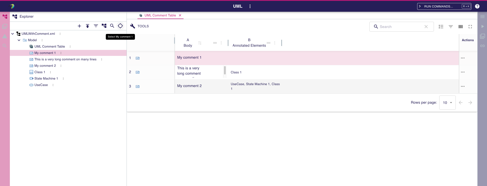

= Table tests
:toc:

[WARN]
====
Do all these tests sequentially
====

== Play with UML Comment Table

.Purpose
Check that the table can be created, displayed and that the user can interact as expected.

.Recipe
. Create a _UML Blank_ project 
. Upload the provided link:resources/UMLWithComment.xml[UML Comment file] into the project
. Select `Model` root object and create `UML Comment Table` representation
** [ ] The table editor is opened
** [ ] The table contains the following content:
+

. Select a row in table in the UML Comment row header and apply the focus tool on the Explorer
** [ ] The corresponding UML Comment is highlighted in the Explorer
. Select `Class 1` cell in `Annotated Elements` column and apply the focus tool on the Explorer
** [ ] `Class 1` is highlighted in the Explorer
. Select a cell in `Body` column and write something to change the cell content
** [ ] The documentation body is changed consequently in the Explorer
. In the Search field write the word `Th` and validate
** [ ] The table displays only one row
. Select a cell in `Body` column and write something to change the cell content
** [ ] The documentation body is changed consequently in the Explorer

== Fork UML Comment Table

.Purpose
Check that the table description can be forked.

.Recipe
. Select the table in the Explorer and click `Fork View Model` in the contextual menu
** [ ] The forked View project is opened
. Expand the tree to reach the CellDescription `bodyCell`. Select it and change in Details view the `Value Expression` from `aql:self.body` to `aql:self.body + 'CHECK'`
. Go back to the UML project and open the `UML Comment Table`
** [ ] The cells of `Body` columns contains the `CHECK` string.

