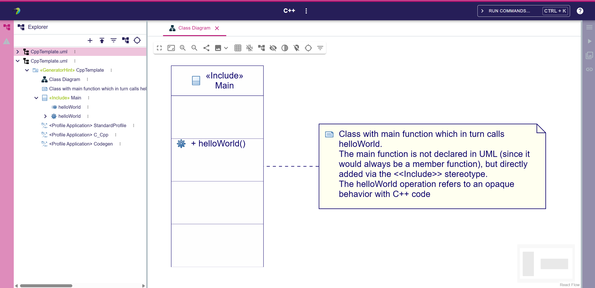
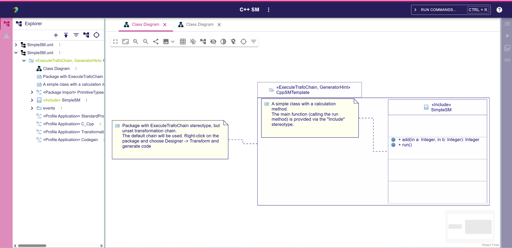
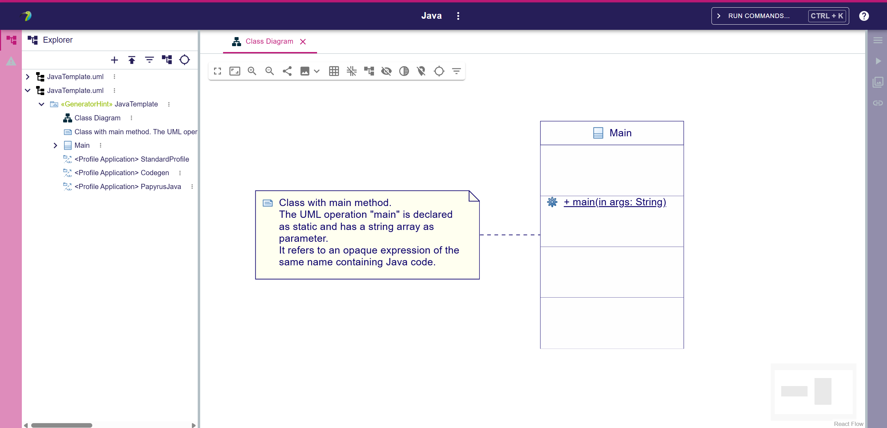

= Project Templates
:toc:

== PT01 - Available templates

.Purpose
Check that all templates are available from the home page

.Recipe
. Home Papyrus Web home page
** [ ] Check that following project cards are available:
*** _+ UML_
*** _+ Profile_
*** _+ UML Empty_
*** _+ {cpp}_
+** [ ] In addition, check that these actions cards are available:
+*** _+ Upload Project_
+*** _+ Show all templates_

. Click on _Show all templates_
** [ ] All previous cards should be available
** [ ] Check that *only* the following project cards are also available:
*** _+ {cpp} SM_
*** _+ Java_
*** _+ Papyrus Studio_

For example, the `Blank Project` card does not appear on the home page nor in the "all templates" dialog

== PT10 - _UML_ template

.Purpose
Check the content of the _UML_ template

.Recipe
. Using the _+ UML_ card create a new _UML_ project
** [ ] Check that the model contains UML primitives types:

== PT20 - _Profile_ template

.Purpose
Check the content of the _Profile_ template

.Recipe
. Using the _+ Profile_ card create a new _Profile_ project
** [ ] Check that the model contains the following package imports:
*** _<Package Import> PrimitiveTypes_
*** _<Package Import> UML_
. Open the default Profile Diagram
** [ ] Check that the diagram is empty (no predefined elements):

== PT30 - _UML Empty_ template

.Purpose
Check the content of the _UML Empty_ template

.Recipe
. Using the _+ UML Empty_ card create a new _UML Empty_ project
** [ ] Check that the project structure is empty

== PT40 - _{cpp}_ template

.Purpose
Check the content of the _{cpp}_ template

.Recipe
. Using the _+ {cpp}_ card create a new _{cpp}_ project
** [ ] Check that the content of the model is similar to link:resources/CppTemplate.uml[]
. Open the _Main_ Class Diagram
** [ ] Check that the diagram display the same elements as:

image::imgs/diag-PT40.png[]

== PT50 - _{cpp} SM_ template

.Purpose
Check the content of the _{cpp} SM_ template

.Recipe
. Using the _+ {cpp} SM_ card create a new _{cpp} SM_ project
** [ ] Check that the content of the model is similar to link:resources/SimpleSM.uml[]
. Open the _Simple SM_ Class Diagram
** [ ] Check that the diagram display the same elements as:

image::imgs/diag-PT50.png[]

== PT60 - _Java_ template

.Purpose
Check the content of the _Java_ template

.Recipe
. Using the _+ Java_ card create a new _Java_ project
** [ ] Check that the content of the model is similar to link:resources/JavaTemplate.uml[]
. Open the _Main_ Class Diagram
** [ ] Check that the diagram display the same elements as:

image::imgs/diag-PT60.png[]

== PT70 - _Papyrus Studio_ template

.Purpose
Check the content of the _Papyrus Studio_ template

.Recipe
. Using the _+ Papyrus Studio_ card create a new _Papyrus Studio_ project (available in "Show all templates")
** [ ] Check that the project contains multiple diagram types in alphabetical order:
*** _Activity Diagram Studio_
*** _Class Diagram Studio_
*** _Communication Diagram Studio_
*** _etc._

image::imgs/diag-PT70.png[]
